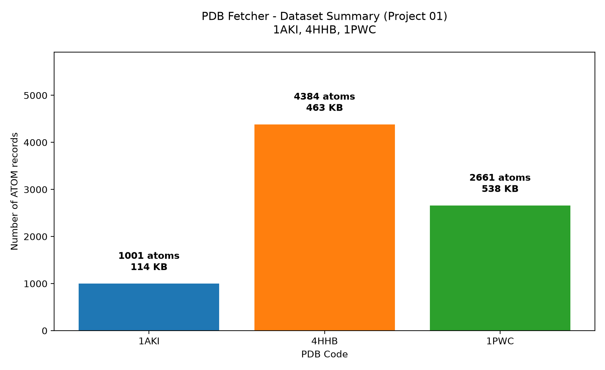

# 🧬 PDB Geometry 01 - Fetcher

A Python console tool that downloads 3 curated PDB structures needed for the full PDB Geometry series (Projects 1-5) and generates a validation plot.

## 👤 Author
**Urva Sohail**

## ✨ Features
- **📥 Auto Download**: Fetches 3 structures from RCSB PDB (1AKI, 4HHB, 1PWC)
- **📂 Smart Skip**: Skips file if already exists locally
- **✅ Validation**: Checks ATOM count and file size after download
- **📊 Visualization**: Generates `fetcher_plot.png` summary chart
- **🐍 Simple Python**: Only `urllib` + `matplotlib`

## 💻 Technologies Used
- **Python 3+**: Core language
- **urllib.request**: For downloading from RCSB
- **pathlib**: For file handling
- **matplotlib**: For dataset summary plot

## 🚀 How to Run
1. Open folder `pdb-geometry-01-fetcher`
2. Run in terminal:
```
bash
python main.py
```
3.Output files will be created in same folder

## 📥 Sample Output
```
skipped: 1aki.pdb (already exists, 1001 ATOMs)
skipped: 4hhb.pdb (already exists, 4584 ATOMs)
skipped: 1pwc.pdb (already exists, 2661 ATOMs)

Done. Total 3 files ready for Projects.
Image saved: fetcher_plot.png -
```
## 📊 Generated Plot
`fetcher_plot.png` shows atom counts for each structure:
- 1AKI - 1001 atoms / 114 KB (Lysozyme - smallest)
- 4HHB - 4584 atoms / 463 KB (Hemoglobin - tallest, 4 chains)
- 1PWC - 2661 atoms / 538 KB (DD-peptidase - high res)

The chart confirms all 3 PDBs were fetched successfully and validates file integrity by showing ATOM count vs file size.


## 📁 Downloaded Files
```
1aki.pdb - Lysozyme 129aa 1.5Å (113 KB)
4hhb.pdb - Hemoglobin 574aa 1.74Å (462 KB)
1pwc.pdb - DD-peptidase 1.1Å ultra high-res (537 KB)
fetcher_plot.png - Dataset summary chart
main.py - Fetcher + plot code
```

## ⚙️ How It Works
- The program creates a list PDB_CODES = ["1AKI", "4HHB", "1PWC"]
- For each code, it builds URL https://files.rcsb.org/download/{CODE}.pdb
- It checks if file already exists locally - if yes, it skips to save time
- If not, it downloads via urllib.request.urlretrieve()
- It saves file as lowercase name like 1aki.pdb and shows size in KB
- At end it counts total files and prints "Ready for Project "

## 🔮 Future Improvements
- [ ] Read input from `.cif` files too
- [ ] Calculate download speed and time
- [ ] Export results to CSV for data analysis
- [ ] Add support for large batch downloads (100+ PDBs)
